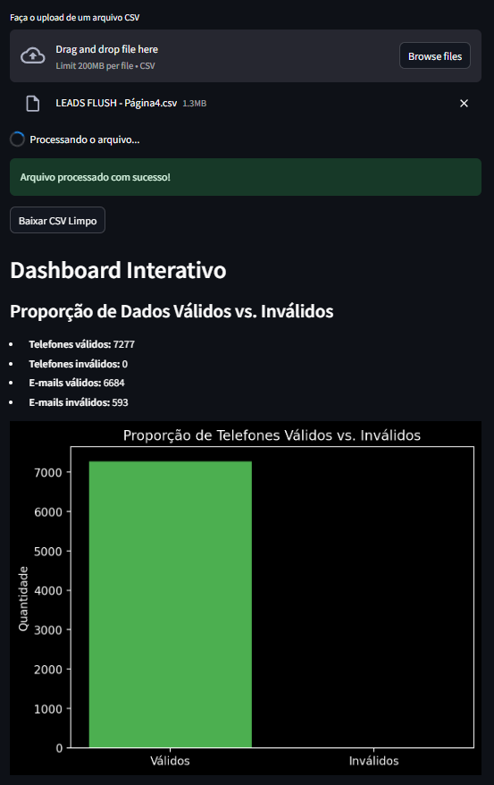
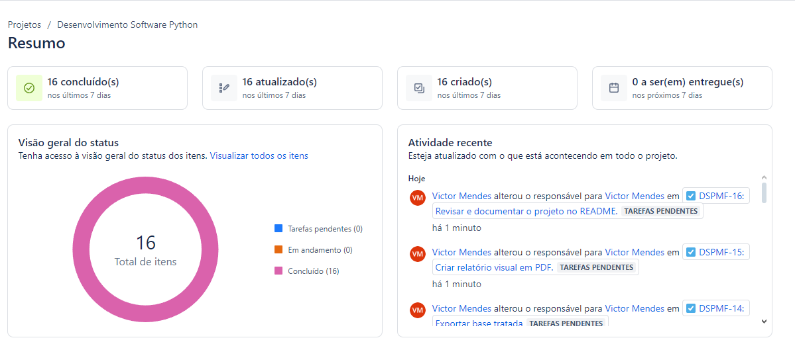
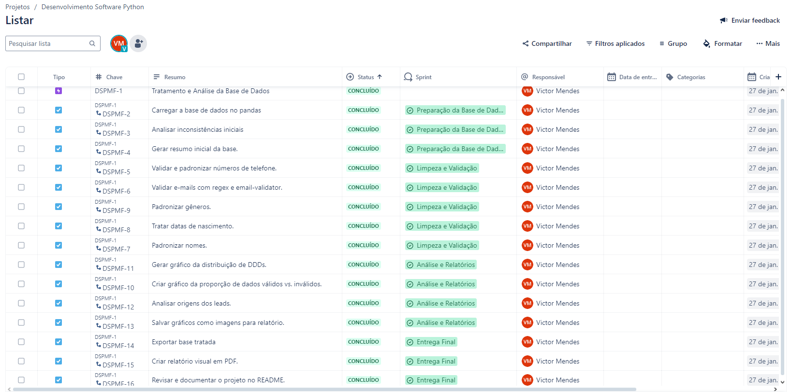

# CSV Cleaner - Flush
🚀 Uma ferramenta interativa e altamente funcional para limpeza, validação e padronização de dados em arquivos CSV. Desenvolvido com **Python** e **Streamlit**, este projeto foi cuidadosamente planejado e executado para destacar habilidades em análise de dados, organização e metodologias ágeis.



---

## 🌟 **Principais Funcionalidades**
- **Validação e formatação de números de telefone**:
  - Detecta e corrige números de telefone brasileiros no formato `<DDD><9><número de 8 dígitos>`.
  - Exclui automaticamente leads sem números válidos.

- **Normalização e validação de e-mails**:
  - Corrige pequenos erros de digitação, como `.con` ou `.co`.
  - Valida o domínio e corrige para domínios conhecidos.

- **Dashboards interativos**:
  - Proporção de dados válidos vs. inválidos.
  - Distribuição de DDDs por frequência.
  - Origem dos leads (dados categóricos).

- **Organização de dados**:
  - Padroniza nomes, datas, idades e outros campos para consistência.

---

## 📊 **Dashboards**
### **1. Proporção de Dados Válidos vs. Inválidos**
Uma visão clara da qualidade dos dados, destacando números e e-mails válidos.

### **2. Distribuição de DDDs**
Gráfico de barras mostrando a frequência dos DDDs mais usados. Insights importantes para campanhas regionais.

### **3. Origem dos Leads**
Análise categórica que exibe as principais fontes de aquisição de dados (por exemplo: redes sociais, campanhas específicas).

---

## 🛠️ **Tecnologias Utilizadas**
- **Python 3.9+**
- **Streamlit**: Interface interativa.
- **Pandas**: Manipulação e limpeza de dados.
- **Matplotlib/Seaborn**: Visualização de dados.
- **Email-validator**: Validação de e-mails.
- **Phonenumbers**: Validação e formatação de números de telefone.

---

## 📂 **Organização e Planejamento**
Este projeto foi estruturado e executado com metodologias ágeis, utilizando o **Jira** para organização e acompanhamento das tarefas. O desenvolvimento foi dividido em **épicos, sprints e tarefas** específicas para manter o progresso consistente e alinhado aos objetivos.

### 📝 **Tarefas e Sprints**

### **Sprint: Preparação da Base de Dados**
- **Tarefa:** Carregar a base de dados no pandas. ✅
- **Tarefa:** Analisar inconsistências iniciais. ✅
- **Tarefa:** Gerar resumo inicial da base. ✅

### **Sprint: Limpeza e Validação**
- **Tarefa:** Validar e padronizar números de telefone. ✅
- **Tarefa:** Validar e-mails com regex e email-validator. ✅
- **Tarefa:** Padronizar gêneros. ✅
- **Tarefa:** Tratar datas de nascimento. ✅
- **Tarefa:** Padronizar nomes. ✅

### **Sprint: Análise e Relatórios**
- **Tarefa:** Gerar gráfico da distribuição de DDDs. ✅
- **Tarefa:** Criar gráfico da proporção de dados válidos vs. inválidos. ✅
- **Tarefa:** Analisar origens dos leads. ✅
- **Tarefa:** Salvar gráficos como imagens para relatório. ✅

### **Sprint: Entrega Final**
- **Tarefa:** Exportar base tratada. ✅
- **Tarefa:** Criar relatório visual em PDF. ✅
- **Tarefa:** Revisar e documentar o projeto no README. ✅






Essa abordagem destaca habilidades como **planejamento**, **gestão de projetos** e **organização de tarefas**, que são essenciais em ambientes corporativos.

---

## 🚀 **Como Usar**
### 1. Clone o Repositório:
```
git clone https://github.com/YOUR-USERNAME/csv-cleaner-flush.git
cd csv-cleaner-flush
```
### 2. Crie um Ambiente Virtual:
```
python -m venv venv
```
### 3. Ative o Ambiente Virtual:
- **Windows**:
  ```
  venv\Scripts\activate
  ```
- **Linux**:
  ```
  source venv/bin/activate
  ```

### 4.  Instale as Dependências:
```
pip install -r requirements.txt
```
### 5. Execute a Aplicação:
```
streamlit run src/app.py
```
## 📝 Licença
Este projeto está licenciado sob a MIT License - veja o arquivo LICENSE para mais detalhes.

## 🤝 Contribuições
Contribuições são bem-vindas! Sinta-se à vontade para abrir issues ou enviar pull requests para melhorias.

## 📞 Contato
Para dúvidas ou sugestões:

- E-mail: contato@vhmac.com
- LinkedIn: linkedin.com/in/vhmac
